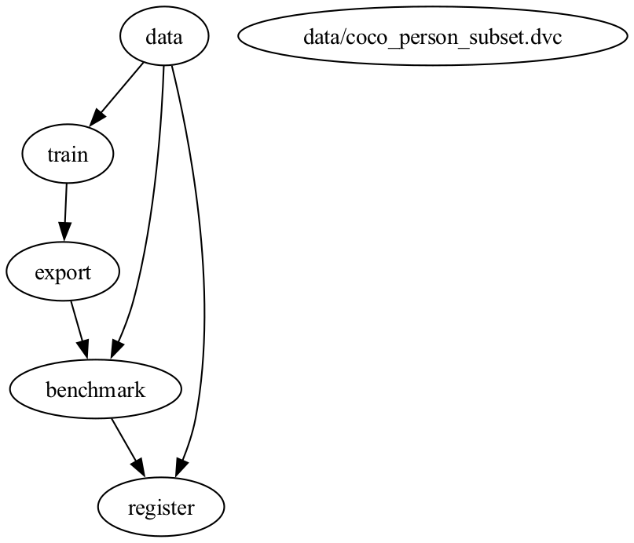
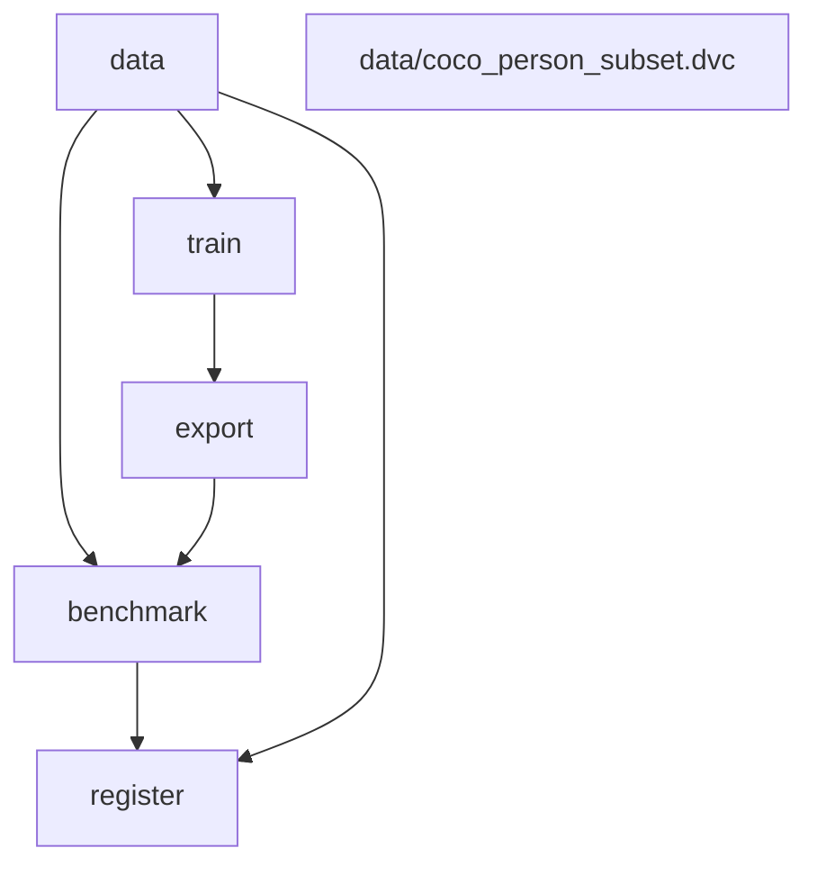
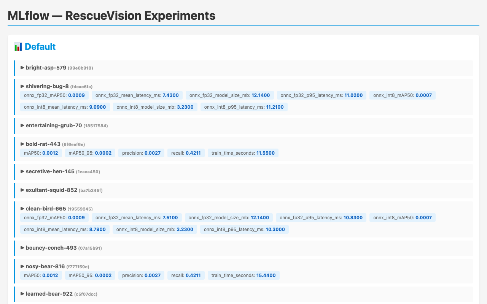
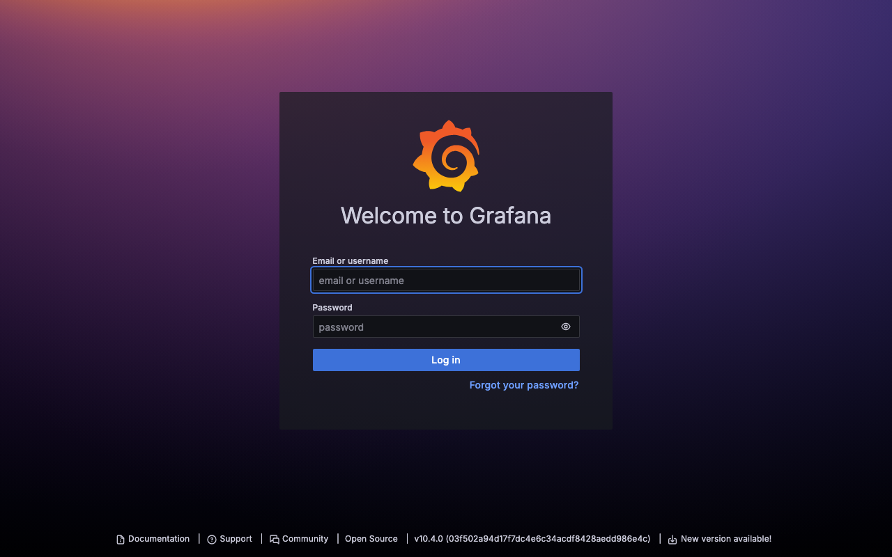
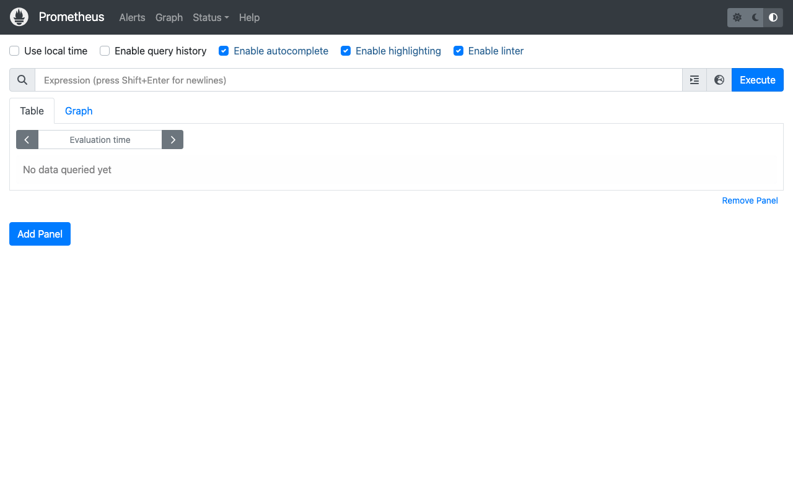

# RescueVision MLOps

End-to-end ML pipeline for SAR victim detection — from versioned dataset to edge-ready model artifacts and a production inference server.

> **Testing status:** All stages verified end-to-end via `dvc repro` (debug mode) and `make debug`. Unit tests cover the serving layer (74% coverage, enforced), metric gate logic, export shapes, and benchmark SLOs.

---

## Pipeline

### DVC Pipeline DAG



```
dataset (DVC)
  → train YOLOv8n (MLflow)
  → export ONNX FP32 / INT8 + TFLite INT8
  → benchmark + metric gate
  → MLflow Model Registry (Staging → Production)
  → FastAPI inference server
  → Prometheus + Grafana
```



---

### MLflow Tracking



Training metrics (mAP50, precision, recall) and benchmark results (latency, model size) are logged per run.

---

### Monitoring Stack





Prometheus scrapes inference metrics from the FastAPI server; Grafana provides pre-configured dashboards.

---

## Quickstart

Requires [uv](https://docs.astral.sh/uv/) and Python ≥ 3.10.

```bash
git clone <your-repo-url>
cd rescuevision-mlops

# Install dependencies
make install-dev

# Run the full ML pipeline via DVC (debug mode, no GPU required)
DEBUG_MODE=true dvc repro

# Or use the Makefile shortcut:
make debug

# Start the inference server + monitoring stack
make up
```

**Debug mode** generates synthetic data, trains 1 epoch on CPU, and skips DVC remote pulls — works on any machine with no credentials.

For the full pipeline with real data, set up DagsHub credentials (see [docs/setup.md](docs/setup.md)) and run:

```bash
dvc repro
```

> Docker is required for the serving + monitoring stack. On macOS, use [Colima](https://github.com/abiosoft/colima):
> ```bash
> brew install colima docker docker-compose
> colima start
> ```

| Service | URL | Credentials |
|---|---|---|
| FastAPI Server | http://localhost:8080/docs | — |
| MLflow UI | http://localhost:5000 | — |
| Grafana | http://localhost:3000 | admin / rescuevision |
| Prometheus | http://localhost:9090 | — |

---

## Running individual pipeline stages

```bash
# Stage 1 — data pull + validation
uv run python -m pipeline.stage1_data

# Stage 2 — training (requires make install-train)
uv run python -m pipeline.stage2_train

# Stage 3 — export & quantization (verified)
uv run python -m pipeline.stage3_export

# Stage 4 — benchmark
uv run python -m pipeline.stage4_benchmark

# Stage 5 — register to MLflow (Staging)
uv run python -m pipeline.stage5_register --stage Staging

# Promote Staging → Production (with mAP50 regression guard)
uv run python -m pipeline.stage_promote

# Debug mode — runs stages 1-3 with dummy data, no GPU required
make debug
```

---

## Documentation

| Doc | What's in it |
|---|---|
| [docs/setup.md](docs/setup.md) | Prerequisites, install, env vars, DVC remote |
| [docs/pipeline.md](docs/pipeline.md) | Phase 1 — stages 1-5 reference |
| [docs/serving.md](docs/serving.md) | Phase 2 — API reference, Docker, architecture |
| [docs/monitoring.md](docs/monitoring.md) | Prometheus metrics, Grafana dashboard |
| [docs/testing.md](docs/testing.md) | How to test everything, start to finish |
| [docs/ci-cd.md](docs/ci-cd.md) | CI/CD jobs, environments, secrets |
| [docs/architecture.md](docs/architecture.md) | Architecture decisions and trade-offs |

---

## Repo layout

```
rescuevision-mlops/
├── pipeline/          # Stage 1-5 scripts
├── core/              # Logger, config loader, MLflow helpers
├── app/               # FastAPI serving layer
│   ├── components/    # ModelLoader, Preprocessor, Postprocessor, Runner, Metrics
│   ├── config/        # ConfigurationManager
│   ├── constant/      # All constants
│   ├── entity/        # Dataclass config entities
│   ├── pipeline/      # PredictionPipeline
│   ├── router/        # FastAPI routes
│   ├── schema/        # Pydantic request/response models
│   ├── middleware/     # Request logger + metrics hook
│   └── utils/         # Shared utilities
├── configs/           # train_config.yaml, serve_config.yaml
├── monitoring/        # Prometheus scrape config + Grafana provisioning
├── tests/
│   ├── serve/             # API + component unit tests (mocked, 74% coverage)
│   ├── test_metric_gate.py  # Pure logic tests for metric gate
│   ├── test_data.py
│   ├── test_export.py
│   ├── test_benchmark.py
│   └── test_register.py   # MLflow registry smoke tests (needs DAGSHUB_* env)
├── research/          # Jupyter notebooks
├── scripts/           # smoke_test.sh
├── docs/              # All documentation
├── dvc.yaml           # Pipeline DAG
├── pyproject.toml     # Ruff, mypy, pytest config
└── .pre-commit-config.yaml
```
