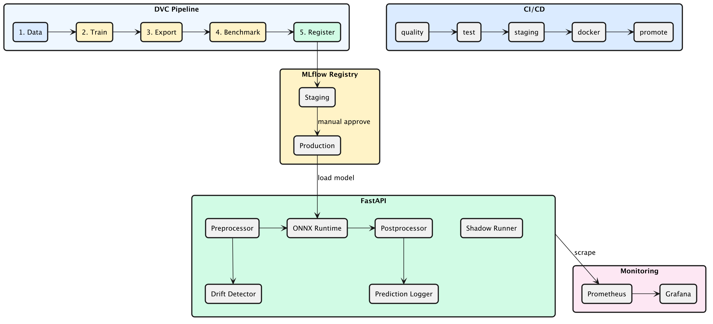

# RescueVision MLOps

[](https://github.com/jaweed3/rescuevision-mlops/actions/workflows/pipeline.yml)


End-to-end MLOps platform for search-and-rescue victim detection from drone footage. Trains YOLOv8n, exports to edge-optimized formats (ONNX FP32/INT8, TFLite INT8), benchmarks and registers artifacts, and serves predictions behind a production FastAPI server with drift monitoring, feedback collection, and shadow deployment.

---

## Architecture



<details>
<summary>Text overview</summary>

```
DVC Pipeline
  1. Data — pull + validate labels
  2. Train — YOLOv8n via Ultralytics
  3. Export — ONNX FP32, ONNX INT8 (dynamic quantization), TFLite INT8
  4. Benchmark — latency (mean/p95) + mAP50 on validation set
  5. Register — metric gate (INT8 mAP50 >= 97% of FP32) → MLflow Model Registry

Serving
  FastAPI → Preprocessor → ONNX Runtime → Postprocessor → Response
                                    ↕                   ↕
                            Drift Detector      Prediction Logger
                                    ↕
                            Shadow Runner (optional A/B)

Monitoring
  FastAPI /metrics → Prometheus → Grafana
```

</details>

---

## Results

| Format | Size | Mean Latency | P95 Latency | Notes |
|--------|------|-------------|-------------|-------|
| ONNX FP32 | 12.1 MB | 7.4 ms | 11.0 ms | Baseline |
| ONNX INT8 | 3.2 MB | 9.1 ms | 11.2 ms | 74% smaller, ~22% slower |
| TFLite INT8 | ~3 MB | — | — | Edge/mobile deployment |

*Benchmarked on 100 validation images, CPU inference.*

The INT8 model's mAP50 must stay within 97% of the FP32 baseline to pass the metric gate — poor quantizations are automatically rejected from the registry.

---

## Key Features

### Model Quantization & Benchmarking

Dynamic quantization (ONNX Runtime) converts FP32 weights to INT8 with minimal accuracy loss. Each artifact is benchmarked for latency (mean + p95) and mAP50 on the validation set. The metric gate enforces quality before registration.

### Drift Detection

Per-request input statistics (brightness, contrast, entropy) are scored against a training-data baseline using Mahalanobis distance. Scores above 3.0 trigger Prometheus alerts. Baseline is computed offline from training images.

### Shadow Deployment

A candidate model can run alongside the primary for silent A/B comparison. Shadow outputs are logged but never returned to the client — zero risk to production traffic.

### Feedback Loop

Ground truth labels can be submitted via `POST /feedback` and paired with prediction logs via `request_id` for offline mAP evaluation.

### Model Registry with Auto-Rollback

Promotion from Staging to Production includes an mAP50 regression guard (>1% drop blocks promotion) and optional health-check polling with automatic rollback on failure.

---

## Quickstart

Requires [uv](https://docs.astral.sh/uv/) and Python >= 3.10.

```bash
git clone https://github.com/jaweed3/rescuevision-mlops.git
cd rescuevision-mlops

# Install dependencies
make install-dev

# Run the full ML pipeline via DVC (debug mode, no GPU required)
DEBUG_MODE=true dvc repro

# Or use the Makefile shortcut:
make debug

# Start the inference server + monitoring stack
make up
```

**Debug mode** generates synthetic data, trains 1 epoch on CPU, and skips DVC remote pulls — works on any machine with no credentials.

For the full pipeline with real data, set up DagsHub credentials (see [docs/setup.md](docs/setup.md)) and run:

```bash
dvc repro
```

> Docker is required for the serving + monitoring stack. On macOS, use [Colima](https://github.com/abiosoft/colima):
> ```bash
> brew install colima docker docker-compose
> colima start
> ```

| Service | URL | Credentials |
|---|---|---|
| FastAPI Server | http://localhost:8080/docs | — |
| Grafana | http://localhost:3000 | admin / rescuevision |
| Prometheus | http://localhost:9090 | — |

---

## Monitoring


Prometheus scrapes inference metrics (request rate, latency histogram, drift score, detection count) from the FastAPI server every 15 seconds. Pre-configured alert rules cover:

- **High latency** — p95 inference > 150ms or request duration > 500ms
- **Error rate** — 5xx responses exceed 5% of total
- **Drift** — input drift score > 3.0
- **Traffic drop** — zero requests for 5 minutes
- **Detection anomaly** — detection rate drops >70% vs previous day


---

## Running Individual Stages

```bash
# Stage 1 — data pull + validation
uv run python -m pipeline.stage1_data

# Stage 2 — training (requires make install-train)
uv run python -m pipeline.stage2_train

# Stage 3 — export & quantization
uv run python -m pipeline.stage3_export

# Stage 4 — benchmark
uv run python -m pipeline.stage4_benchmark

# Stage 5 — register to MLflow (Staging)
uv run python -m pipeline.stage5_register --stage Staging

# Promote Staging → Production (with mAP50 regression guard)
uv run python -m pipeline.stage_promote

# Compute drift baseline from training images
uv run python scripts/compute_baseline.py
```

---

## Testing

```bash
# Run all tests with coverage
make test

# Run specific test suites
uv run pytest tests/serve/ -v        # API + component tests
uv run pytest tests/test_benchmark.py -v  # Pipeline stage tests
```

49 tests covering pipeline stages (data validation, export, benchmark, metric gate, registration) and serving layer (API endpoints, preprocessor, postprocessor, prediction logger, security).

---

## Documentation

| Doc | What's in it |
|---|---|
| [docs/setup.md](docs/setup.md) | Prerequisites, install, env vars, DVC remote |
| [docs/pipeline.md](docs/pipeline.md) | Phase 1 — stages 1-5 reference |
| [docs/serving.md](docs/serving.md) | Phase 2 — API reference, Docker, architecture |
| [docs/monitoring.md](docs/monitoring.md) | Prometheus metrics, Grafana dashboard, drift alerts |
| [docs/testing.md](docs/testing.md) | How to test everything, start to finish |
| [docs/ci-cd.md](docs/ci-cd.md) | CI/CD jobs, environments, secrets |
| [docs/architecture.md](docs/architecture.md) | Architecture decisions and trade-offs |

---

## Tech Stack

| Layer | Technologies |
|---|---|
| ML | YOLOv8n, Ultralytics, ONNX Runtime, TensorFlow (TFLite) |
| Serving | FastAPI, uvicorn, Pydantic v2, SlowAPI |
| Tracking | MLflow (DagsHub), DVC |
| Monitoring | Prometheus, Grafana |
| Infra | Docker, Kubernetes, GitHub Actions |
| Quality | Ruff, mypy, pytest, pre-commit |

---

## Repo Layout

```
rescuevision-mlops/
├── pipeline/          # Stage 1-5 scripts
├── core/              # Logger, Pydantic config, MLflow helpers
├── app/               # FastAPI serving layer
│   ├── components/    # Preprocessor, Runner, Postprocessor, Metrics, DriftDetector
│   ├── pipeline/      # PredictionPipeline (wires components)
│   ├── router/        # Routes (predict, health, meta, metrics, feedback)
│   ├── middleware/     # Request logger, security headers
│   └── schema/        # Pydantic request/response models
├── configs/           # train_config.yaml, serve_config.yaml
├── monitoring/        # Prometheus + Grafana provisioning
├── k8s/               # Kubernetes manifests
├── tests/             # 49 tests (pipeline + serving)
├── docs/              # All documentation
├── scripts/           # compute_baseline.py, smoke_test.sh
├── dvc.yaml           # Pipeline DAG
├── docker-compose.yml # Infra stack
└── Dockerfile         # Multi-stage uv build
```

---

## License

MIT
