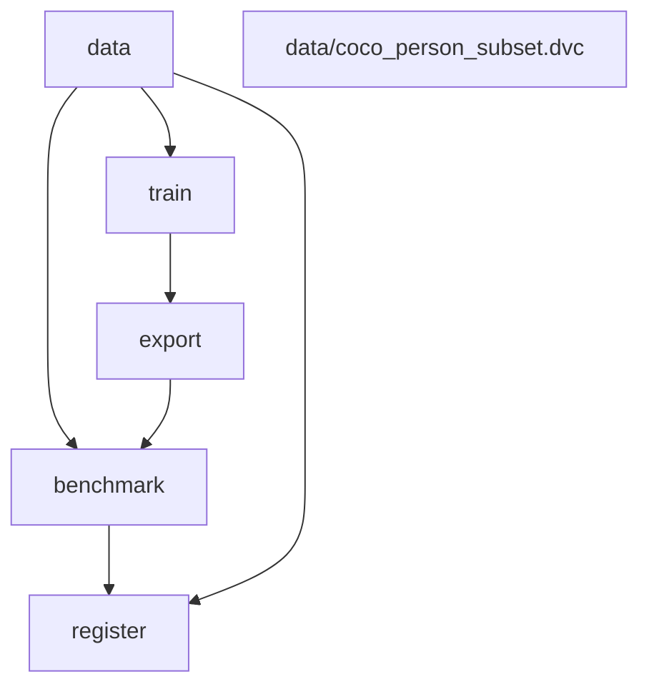

```mermaid
flowchart TD
	node1["benchmark"]
	node2["data"]
	node3["export"]
	node4["register"]
	node5["train"]
	node1-->node4
	node2-->node1
	node2-->node4
	node2-->node5
	node3-->node1
	node5-->node3
	node6["data/coco_person_subset.dvc"]
```
