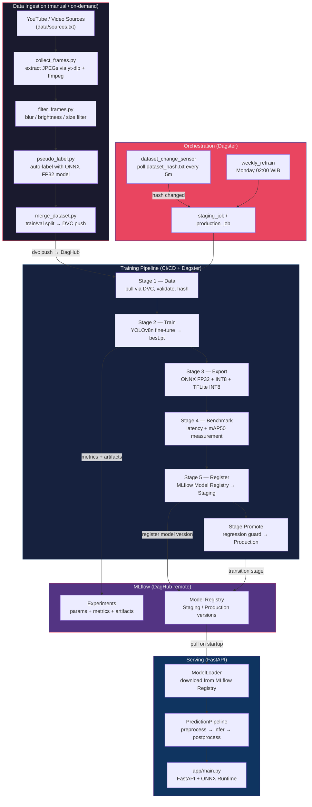
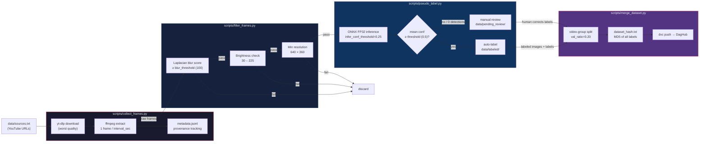
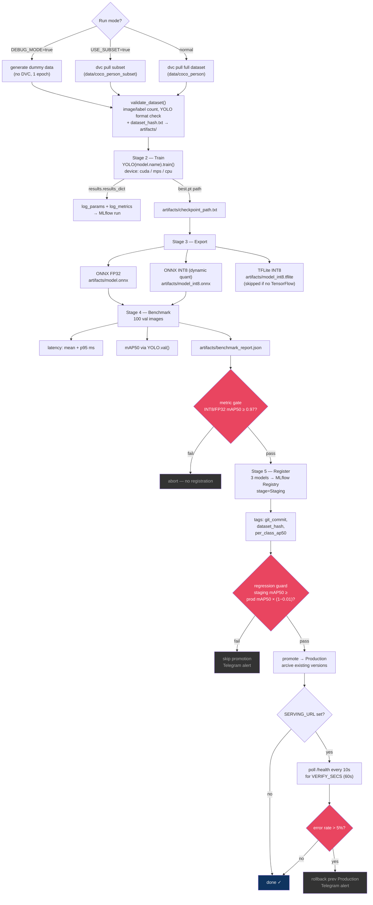
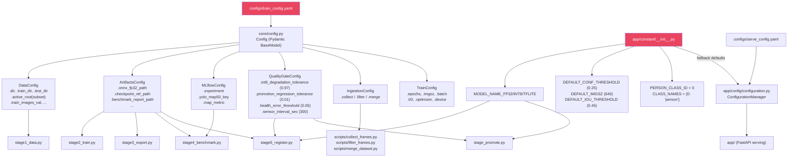
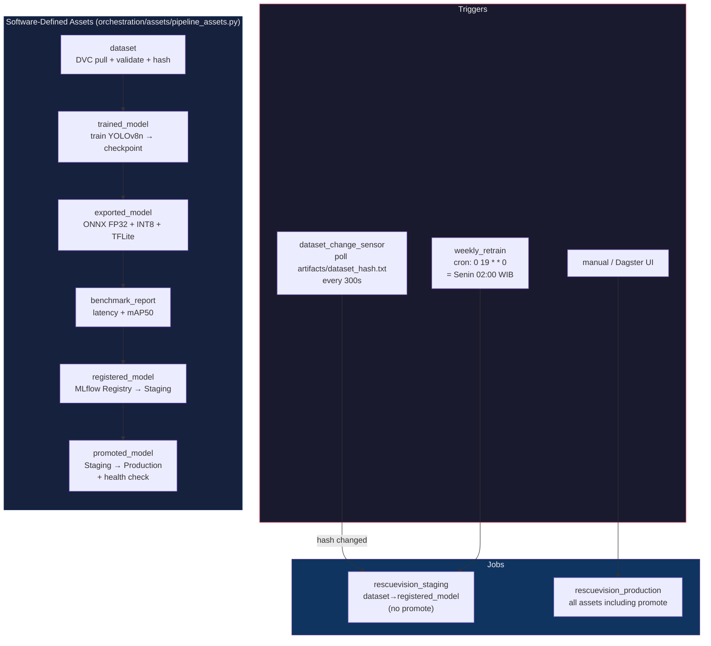
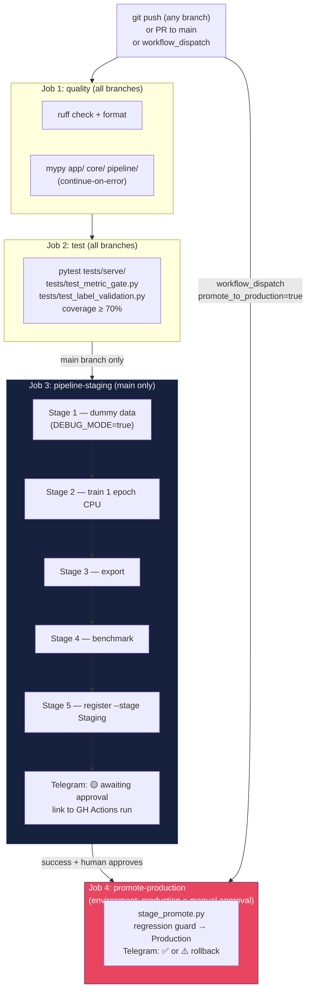
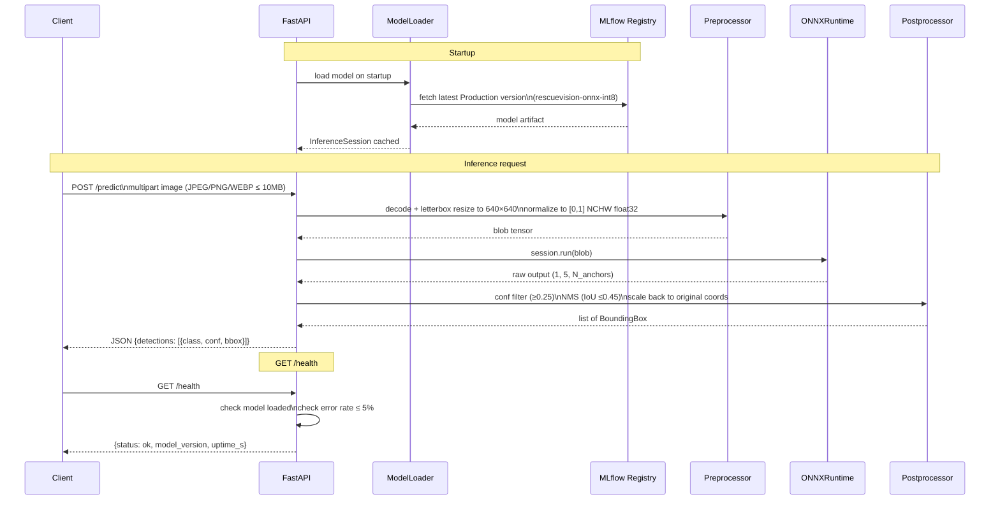

# RescueVision MLOps — End-to-End Flow

Complete reference for how data, code, and models move through the system.

---

## 1. System Overview



---

## 2. Data Ingestion Pipeline

Run manually when new video data is available. Output feeds directly into training via DVC.



### Key thresholds (all in `configs/train_config.yaml → ingestion`)

| Parameter | Value | Location |
|---|---|---|
| `interval_sec` | 2 s | `ingestion.collect.interval_sec` |
| `max_frames_per_video` | 500 | `ingestion.collect.max_frames_per_video` |
| `blur_threshold` | 100 | `ingestion.filter.blur_threshold` |
| `brightness_min/max` | 30 / 225 | `ingestion.filter.brightness_*` |
| `min_width/height` | 640 / 360 | `ingestion.filter.min_*` |
| `val_ratio` | 0.20 | `ingestion.merge.val_ratio` |
| `infer_conf_threshold` | 0.25 | `DEFAULT_INFER_CONF_THRESHOLD` in pseudo_label.py |
| `threshold` (mean conf gate) | 0.50 | `DEFAULT_THRESHOLD` in pseudo_label.py |

---

## 3. Training Pipeline — Stage by Stage



### Artifact files produced

| File | Stage | Description |
|---|---|---|
| `artifacts/checkpoint_path.txt` | S2 | Path to `best.pt` used by S3 |
| `artifacts/model.onnx` | S3 | FP32 export |
| `artifacts/model_int8.onnx` | S3 | Dynamic INT8 quantized |
| `artifacts/model_int8.tflite` | S3 | TFLite INT8 (GPU machine only) |
| `artifacts/benchmark_report.json` | S4 | Latency + mAP50 per format |
| `artifacts/dataset_hash.txt` | S1 | MD5 of all label files |

---

## 4. Config Flow — Single Source of Truth



---

## 5. Dagster Orchestration



### Asset metadata emitted

Each asset returns `MaterializeResult` with metadata visible in the Dagster UI:

| Asset | Key metadata |
|---|---|
| `dataset` | `train_count`, `val_count`, `dataset_hash` |
| `trained_model` | `checkpoint_path`, `device`, `epochs`, `imgsz` |
| `exported_model` | `onnx_fp32` MB, `onnx_int8` MB, `tflite_int8` MB |
| `benchmark_report` | `fp32_mAP50`, `int8_mAP50`, `fp32_mean_latency_ms` |
| `registered_model` | `status`, `models` list |
| `promoted_model` | `promoted_models`, `serving_verified` |

---

## 6. CI/CD Pipeline (GitHub Actions)



---

## 7. Serving — FastAPI Inference Flow



---

## 8. Environment Variables Reference

| Variable | Used by | Required |
|---|---|---|
| `DAGSHUB_USERNAME` | stage1, stage_promote, mlflow_client | yes (prod) |
| `DAGSHUB_REPO` | stage1, stage_promote, mlflow_client | yes (prod) |
| `DAGSHUB_TOKEN` | stage1, stage_promote, mlflow_client | yes (prod) |
| `DEBUG_MODE` | all stages | no (default: false) |
| `USE_SUBSET` | all stages | no (default: false) |
| `TRAIN_DEVICE` | stage2 | no (override train.device from yaml) |
| `SERVING_URL` | stage_promote | no (skips health check if unset) |
| `VERIFY_SECS` | stage_promote | no (default: 60) |
| `TELEGRAM_TOKEN` | app/utils/telegram.py | no (silent if unset) |
| `TELEGRAM_CHAT_ID` | app/utils/telegram.py | no |

---

## 9. Local Development Cheatsheet

```bash
# Run full pipeline locally (subset + debug)
USE_SUBSET=true DEBUG_MODE=true make all

# Individual stages
uv run python -m pipeline.stage1_data
uv run python -m pipeline.stage2_train
uv run python -m pipeline.stage3_export
uv run python -m pipeline.stage4_benchmark
uv run python -m pipeline.stage5_register --stage Staging
uv run python -m pipeline.stage_promote

# Start Dagster UI
make dagster-dev   # http://localhost:3000

# Serve the API
make serve         # http://localhost:8080

# Data ingestion
python scripts/collect_frames.py --sources data/sources.txt
python scripts/filter_frames.py --input data/raw_frames
python scripts/pseudo_label.py --input data/filtered_frames
python scripts/merge_dataset.py

# Quality
make quality       # ruff + mypy
make test          # pytest
```
